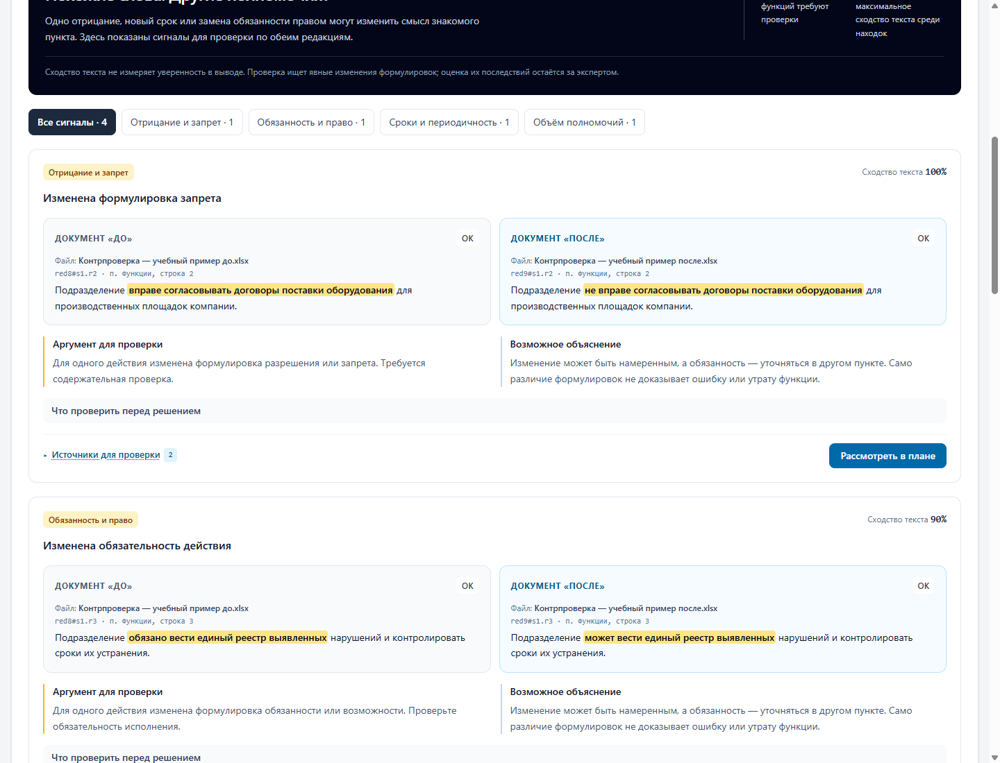

# OrgDiff — ИИ-агент «Анализ организационной структуры и функционала»

HackAlem AI 2026 · Трек 11, спец-трек **Казактелеком** · Команда **Ab.Ai** (1 участник)

> **Проверяющему: API-ключ не нужен.** Весь сценарий проходится на детерминированном ядре —
> разбор документов, сопоставление пунктов и проверка ссылок выполняются по-настоящему.
> Запуск из каталога `server`: `npm install`, затем `npm start`.
> Проверку `npm run verify` выполните из того же каталога **в другом терминале**: сервер занимает первый.

---

## 1. Название проекта

**OrgDiff** — ИИ-агент анализа организационных изменений.

## 2. Краткое описание — какую проблему решает и для кого

При реорганизации подразделений сотрудник вручную сличает положения, оргструктуры и приложения к распорядительным документам. Документ — 470 пунктов на 40 страниц, редакций две, и нумерация между ними сквозным образом сдвинута. Ошибка стоит дорого: функция теряется при переносе, две службы получают одну зону ответственности, контролёр начинает проверять собственный план.

**Пользователь** — сотрудник подразделения, проводящий анализ организационных изменений.

OrgDiff сравнивает комплекты документов «до» и «после», показывает, какие подразделения созданы, сохранены и упразднены, какие функции потеряны, а какие лишь сменили владельца, где функционал дублируется и где возникает конфликт интересов. **Каждый вывод сопровождается ссылкой на конкретный пункт исходного документа с точной цитатой.**

## 3. Что реализовано — основные функции

**Центральный сценарий — «План реорганизации».** Интерактивная карта показывает, куда перешли функции; нажатие на связь раскрывает пункты «до» и «после». В очереди находок сотрудник выбирает решение, ответственного, обоснование и источники. Счётчики показывают рассмотренные и открытые вопросы. По назначениям формируется проект формулировки, а Excel содержит обзор, план решений, точные цитаты и сопоставление функций. Это рабочий проект для согласования, не изменение исходных документов и не подтверждение устранения рисков.

Маршрут демонстрации на 90 секунд: [docs/demo-pitch.md](docs/demo-pitch.md).

Проверка обязательных требований и оставшихся ограничений: [docs/task-audit.md](docs/task-audit.md). Паспорт **«Что вошло в анализ»** показывает распознанные пункты, связи с владельцами, неопределённые строки и допущения общих заголовков. Явно названная роль без отдельного подразделения участвует в сравнении как роль, не меняя состав подразделений. Все цитаты отчёта проверяются перед выдачей API.

[Снимок паспорта неполного анализа](docs/screenshots/11-analysis-coverage.png). Результат финального прогона тестов, контрольных проверок и браузерного сценария — в [docs/task-audit.md](docs/task-audit.md).

**Комплекты из нескольких файлов.** В каждую редакцию можно добавить от 1 до 5 файлов DOCX, текстового PDF или XLSX, в том числе разных форматов. Лимит одного файла — 20 MiB, общий лимит обеих редакций — 100 MiB (1 MiB = 1 048 576 байт; интерфейс обозначает эти величины как МБ). Новые выборы и перетаскивания дополняют список; файлы удаляются по отдельности. Невалидная подборка не заменяет уже выбранные файлы. Состав каждой редакции виден в отчёте и на листе Excel «Комплект документов», имя исходного файла — рядом с цитатой, в источниках решения и в контрпроверке.

[Снимок анализа четырёх файлов](docs/screenshots/12-document-collection.png).

**Контрпроверка формулировок.** В сопоставленных пунктах отдельно проверяются отрицание, обязанность/право, явные сроки и охват. Даже при 100% сходстве значимых слов «вправе» → «не вправе» больше не получает метку «без изменений». Интерфейс показывает точные цитаты рядом, подсвечивает изменённый фрагмент и предлагает альтернативное объяснение. Находку можно передать на согласование или отклонить с обоснованием и источниками обеих редакций; при наличии таких находок Excel включает отдельный лист «Контрпроверка».

Нажмите **«Найти скрытые изменения»** для открытого синтетического примера: четыре изменения и два неизменных пункта с «не позднее» / «не реже». XLSX можно скачать и загрузить обратно — используется тот же пайплайн. Это ограниченные правила проверки формулировок, а не универсальное понимание смысла: неоднозначные повторяющиеся действия, неизвестные конструкции и пункты без пары требуют отдельной проверки.



| | Функция |
|---|---|
| 1 | Разбор комплектов из 1–5 DOCX, текстовых PDF или XLSX на редакцию; источник включает файл и пункт либо лист и строку |
| 2 | Статусы подразделений: создано / сохранено / реорганизовано / отсутствует в новой редакции; переименование, слияние и разделение по подтверждающим фрагментам |
| 3 | Привязка каждой функции к владельцу через заголовки раздела «Права и обязанности» |
| 4 | Сопоставление функций между редакциями **по тексту**: потеряна / передана / добавлена / переформулирована / без изменений |
| 5 | Поиск дублирования функционала между подразделениями |
| 6 | Потенциальный риск совмещения контроля и планирования; требование декларирования не считается конфликтом |
| 7 | Проверка упоминания новых подразделений в разделе функций; результат требует содержательной проверки |
| 8 | Итоговое аналитическое заключение с наблюдениями, рекомендациями и ограничением применения |
| 9 | Валидация ссылок: вывод с несуществующей ссылкой отбрасывается, текст цитаты подставляет парсер |
| 10 | Панель трассировки пайплайна в интерфейсе: шаги, модель, источник ответа, время, счётчик отклонённых ссылок |
| 11 | Работа без API-ключа: детерминированное ядро закрывает весь сценарий |
| 12 | Автопроверка по контрольному набору ожиданий (`npm run verify`) |
| 13 | Контрпроверка небольших изменений формулировок с подсветкой цитат, рассмотрением и экспортом |

## 4. Как работает решение — основной сценарий

```
две редакции: 1–5 файлов DOCX / PDF / XLSX в каждой
   ↓  парсер            → отдельный разбор файлов, опись, адресуемые пункты и строки
   ↓  состав            → определения из файлов объединяются внутри редакции
   ↓  владельцы         → функция ← заголовок руководителя либо столбец подразделения
   ↓  сопоставление     → функции сравниваются по всем файлам двух редакций
   ↓  детекторы         → дублирование, конфликт интересов, нормативные пробелы
   ↓  LLM (опционально) → проверка сопоставлений по цитатам
   ↓  валидатор         → пустые, чужие, неполные ссылки отклоняют ответ
   ↓  заключение        → расчёт по находкам, источники для каждого наблюдения и рекомендации
отчёт: подразделения · функции · дублирование · конфликты · пробелы · заключение
```

**Ключевое решение.** Функции сопоставляются по тексту, а не по номерам пунктов. В выданном комплекте между редакциями исчез пункт 5.11, а блоки прав 5.6 и 5.7 объединены в один — вся нумерация раздела 5 поехала. Решение, сравнивающее пункты по номерам, выдало бы полтора десятка несуществующих «потерянных функций». На это есть отдельные отрицательные тесты (`NEG-1`…`NEG-5`).

**Границы файлов сохранены.** Состав подразделений сначала определяется отдельно в каждом файле, затем совместимые определения объединяются в состав редакции. Противоречащие определения названия и аббревиатуры отклоняются с пояснением. Явно названный владелец функции может ссылаться на подразделение из другого файла этой редакции. Общий заголовок «Директоры департаментов обязаны…» ограничен составом своего файла; его область действия не расширяется на остальные приложения. Сопоставление функций и поиск пересечений после этого работают по всему комплекту, без требования попарно соединять файлы «до» и «после».

**Адрес цитаты включает файл.** В редакции из нескольких файлов ссылка имеет вид `red8#f<хеш>.5.4.4б`: исходный номер пункта сохраняется, пространство файла определяется хешем содержимого. Перестановка неизменённых файлов не меняет их ссылки; изменение байтов файла меняет его идентификатор. Для редакции из одного файла сохранён прежний формат `red8#5.4.4б`. В обоих случаях цитата содержит имя исходного файла. Две побайтово одинаковые копии в одной редакции сервер отклоняет, даже если имена различаются; одинаковый файл в обеих редакциях допустим.

**Проверка выводов.** Ядро сопоставляет текст и владельцев. Модель дополнительно проверяет найденные изменения по цитатам. Ответ принимается только при согласованной метке и ссылках на источники именно этой находки; при передаче функции нужны обе редакции. Произвольный текст модели не публикуется: пояснение собирается из проверенных полей, заключение — из находок со ссылками. Существование ссылки само по себе не доказывает произвольное утверждение, поэтому эвристические выводы отмечаются как потенциальные и требуют проверки.

## 5. Технологии

| Слой | Технологии |
|---|---|
| Бэкенд | Node.js 22, ESM без шага сборки, Express 5, zod 4 |
| Разбор документов | mammoth (DOCX), PDF.js (PDF), ExcelJS (XLSX), multer (загрузка) |
| LLM | OpenAI SDK 7, модель `gpt-4.1-mini`, strict structured outputs (`json_schema`) |
| Фронтенд | React 19, TypeScript, Vite 8, Tailwind CSS 4 |
| Тесты | `node:test`: контрольный комплект и независимые сценарии — реорганизация, форматы, несколько файлов, HTTP-загрузка, источники, план и контрпроверка; результат финального прогона — в [docs/task-audit.md](docs/task-audit.md) |

Базы данных нет. На сервере хранятся до 20 отчётов на два часа; решения сохраняются в браузере по отпечатку источников. После перезапуска сервера нужно повторить анализ, затем решения того же комплекта восстанавливаются. Авторизации нет: инструмент однопользовательский. План не является системой подписания или согласования.

## 6. Архитектура

```
server/
  src/
    index.js               Express: /api/health, /api/analyze/demo, /api/analyze
    pipeline.js            оркестрация анализа комплектов, сборка отчёта, валидация схемой
    planning.js            находки → решения пользователя → проект и Excel; проверка источников по серверному отчёту
    types.js               контракт отчёта (zod) — общий для бэкенда и фронтенда
    parse/docx.js          текст DOCX → пункты с идентификаторами
    parse/document.js      выбор DOCX/PDF/XLSX, декодирование имён файлов
    parse/collection.js    разбор комплектов, границы файлов, стабильные ссылки и проверка повторных копий
    parse/evidence.js      цитаты с именами и идентификаторами исходных файлов
    analysis/units.js      объединение состава редакции, локальные заголовки и явно названные владельцы
    analysis/diff.js       сопоставление по тексту, дублирование, конфликты, пробелы
    analysis/material.js   контрпроверка отрицания, обязательности, сроков и охвата
    analysis/quality.js    паспорт распознанной структуры каждого файла
    analysis/evidence-audit.js проверка адресов, цитат и принадлежности исходным файлам
    llm/client.js          вызов модели, запись и воспроизведение фикстур
    llm/enrich.js          проверка сопоставлений, заключение со связанными источниками
  fixtures/llm/            каталог для ответов модели; записанных ответов в поставке нет
  scripts/verify.js        автопроверка по контрольному набору
  test/                    тесты на документах кейса и независимых сценариях
web/src/                   React: таблицы, раскрывающиеся цитаты, панель трассировки
fixtures/
  ground-truth.json        контрольный набор: 16 положительных, 5 отрицательных
  independent-example.json синтетический учебный комплект с ожидаемыми результатами
  countercheck-example.json синтетический пример изменений формулировок
data/                      выданный комплект и ТЗ; XLSX обоих синтетических примеров
docs/screenshots/          снимки прохода по сценарию
```

Собранный фронтенд отдаётся тем же Node-процессом — один порт, одна команда запуска, никакого CORS и реверс-прокси.

## 7. Установка и запуск

Нужен **Node.js 22.13+**. Ни базы данных, ни Docker, ни API-ключа для локального анализа.

```bash
git clone https://github.com/BAITC-Hacks/hack-96363301-ab-ai.git
cd hack-96363301-ab-ai

# фронтенд уже собран и лежит в web/dist — пересобирать не требуется
cd server
npm install
npm start
```

Открыть **http://localhost:3000** и нажать **«Проанализировать демо-комплект»**.

Для своих документов добавьте 1–5 файлов в «Комплект до» и 1–5 в «Комплект после», затем нажмите **«Проанализировать загруженные документы»**. Поддерживаются смешанные комплекты DOCX/PDF/XLSX. Общий перечень файлов и замечания паспорта позволяют проверить, что было распознано из каждого приложения.

<details>
<summary>Пересобрать фронтенд (необязательно)</summary>

```bash
cd web && npm install && npm run build
```
</details>

<details>
<summary>Запуск с живыми вызовами модели (необязательно)</summary>

```bash
cd server              # из корня репозитория, после остановки прежнего сервера
cp .env.example .env    # вписать OPENAI_API_KEY
npm start
```
С ключом добавляется шаг верификации находок моделью, а ответы, прошедшие проверку схемы, записываются в `server/fixtures/llm/`. Для того же запроса и модели сохранённый ответ можно воспроизвести без ключа. Без ключа и подходящего сохранённого ответа шаг помечается как недоступный; детерминированный отчёт остаётся доступен. В текущей проверке живые вызовы API не выполнялись.
</details>

## 8. Как проверить решение

**Первое и главное: приложение проходит весь сценарий без API-ключа.** Разбор документов, сопоставление пунктов, поиск дублирования и конфликтов, проверка ссылок и итоговое заключение — всё это детерминированные шаги, они выполняются по-настоящему и ни от какого внешнего сервиса не зависят.

Роль модели — **верификация уже найденного**: она сверяет сопоставление и его источники, а её ответы записываются в `server/fixtures/llm/` для последующего воспроизведения. **В текущей сборке записанных ответов нет**; без ключа шаг верификации моделью помечен в трассировке как недоступный. Живые вызовы API в текущей проверке не выполнялись; подтверждены локальный сценарий и проверки обработки ответов. Колонка «источник» в панели трассировки показывает, был ли ответ получен от API, прочитан из сохранённого файла или отсутствовал.

### Автопроверка одной командой

Откройте отдельный терминал в корне репозитория. Проверка запускает пайплайн напрямую и не требует работающего HTTP-сервера.

```bash
cd server && npm run verify
```

Скрипт прогоняет пайплайн на выданном комплекте и сверяет результат с `fixtures/ground-truth.json` — это ровно то, что предлагает п. 11 ТЗ («контрольный комплект, где изменения известны заранее»), только автоматически. Код возврата ненулевой при любом расхождении.

```
ИТОГО: 21 из 21 проверок пройдено — все
```

### Трассировка обязательных требований

| Требование кейса (дословно) | Где реализовано | Как проверить |
|---|---|---|
| **1)** Определить по приложениям, какие структурные подразделения были реорганизованы, какие сохранились и какие созданы | `server/src/analysis/units.js` → `extractUnits`, `diffUnits` | `npm run verify` → `UNIT-1`…`UNIT-4`. В интерфейсе — блок «Подразделения». Результат: ДИТААД и ДОА созданы, ДНМ и ДККМ сохранены |
| **2)** Сопоставить функционал преобразованных и существующих подразделений и выявить потенциальную потерю функций | `server/src/analysis/diff.js` → `diffFunctions` | `npm run verify` → `FUNC-1`…`FUNC-4`, `NEG-1`…`NEG-4`. В интерфейсе — блок «Сопоставление функций», фильтры «Утрачена» и «Передана» |
| **3)** Сопоставить функционал подразделений между собой и выявить возможное дублирование функций и конфликт интересов | `server/src/analysis/diff.js` → `findDuplicates`, `findConflicts` | `npm run verify` → `DUP-1`…`DUP-3`, `COI-1`…`COI-2`. В интерфейсе — блок «Дублирование и конфликты интересов» |
| **4)** Для каждого вывода показать подтверждающий источник: документ и соответствующий фрагмент/пункт | `server/src/llm/enrich.js`; `server/src/types.js` → `Evidence` | `npm run verify` → `SRC-1`, включая источники наблюдений и рекомендаций заключения |
| **5)** Сформировать итоговое аналитическое заключение в понятном для пользователя виде | `server/src/llm/enrich.js` → `buildConclusion`, `deterministicConclusion` | `npm run verify` → `CONC-1`. В интерфейсе — блок «Итоговое аналитическое заключение» |
| **Ограничение п. 9:** агент не должен формировать утверждения, не подтверждённые документами | `server/src/llm/enrich.js` — закрытый список допустимых ссылок | `npm test` → тест «ограничение п. 9 ТЗ: каждый вывод имеет подтверждающий источник» |
| **Ограничение п. 9:** выводы носят рекомендательный характер | `server/src/llm/enrich.js` → `DISCLAIMER` | Блок «Ограничение применения» в заключении и в подвале интерфейса |

### Тесты

```bash
cd server && npm test
```

Результат финального прогона — в [docs/task-audit.md](docs/task-audit.md). Тесты комплектов проверяют отдельные пространства ссылок, перестановку файлов, повторные копии, лимиты и анализ через HTTP.

### Что агент находит на выданном комплекте

| Категория | Результат |
|---|---|
| Подразделения | создано 2 (ДИТААД, ДОА), сохранено 2 (ДНМ, ДККМ) |
| Функции | 31 предварительное изменение владельцев (включая 17 соответствий прежней роли), 7 кандидатов на утрату, 13 добавленных закреплений, 3 переформулировки, 44 без изменений |
| Дублирование | 11 прямых пар пересекающегося функционала между подразделениями; транзитивные цепочки не объединяются в группы |
| Конфликт интересов | 1 потенциальный риск: совмещение контроля и планирования у ДККМ. Требования декларирования исключены из счётчика |
| Полнота описания функций | 2 вопроса для проверки: ДИТААД и ДОА не упомянуты в разделе функций; обязанности руководителей есть |

Показательный пример — функция «выявление рисков с недостаточным или дублирующим покрытием субъектами СВК в рамках Карты гарантий». В редакции 8 это п. **5.4.4б**, владелец — Директор ДНМ. В редакции 9 формулировка сохранена дословно, но стоит в п. **5.3.3б**, у директоров ДИТААД и ДОА. Агент помечает это как **передачу**, а не потерю, и показывает оба пункта с цитатами.

Частичное изменение состава владельцев теперь тоже отображается как передача/перераспределение. Короткие вводные к перечислениям не считаются отдельными функциями. В расширенный анализ включены 20 обязанностей «Директора направления внутреннего аудита» из редакции 8: роль не превращается в вымышленный департамент. 17 пунктов получили предварительное текстовое соответствие, три требуют проверки наряду с четырьмя прежними кандидатами. Содержательный разбор всех семи — в [docs/loss-review.md](docs/loss-review.md). Сходство формулировок не доказывает преемственность роли или передачу полномочий.

### Независимый учебный комплект

Кнопка **«Проверить учебный пример»** запускает анализ синтетических XLSX из `data/example_before.xlsx` и `data/example_after.xlsx`. Оба файла можно скачать из интерфейса. Ожидания вручную заданы в `fixtures/independent-example.json`: одно переименование, одно сохранённое, одно созданное и одно отсутствующее подразделение; одна передача, одна утрата, две сохранённые и две добавленные функции, одно пересечение, ноль конфликтов. Их проверяет `server/test/quality.test.js` вместе с точными владельцами и адресами источников. Для пересоздания XLSX из JSON: `cd server && node scripts/build-example.js`.

Отчёт начинается с кратких итогов; таблица показывает изменения первыми, неизменённые функции доступны через фильтр. Похожие фрагменты для ручной проверки выделены отдельно и не считаются установленным соответствием. Техническая трассировка свёрнута; счётчик ответов модели не включает недоступные шаги.

### Снимки прохода по сценарию

В `docs/screenshots/` файлы `01`–`06` — исторические снимки до исправлений; `07-responsibility-map.png`, `08-decision-workbench.png`, `09-organizer-map.png` показывают карту и план, `10-countercheck.png` — контрпроверку синтетического примера, `11-analysis-coverage.png` — паспорт неполного анализа, `12-document-collection.png` — анализ четырёх файлов. Сквозная браузерная проверка: при запущенном сервере и отдельном Chrome с `--remote-debugging-port=9333` выполнить в другом терминале из корня репозитория `cd server && node scripts/browser-smoke.js`. Флаг `--screenshots` обновляет снимки. Проверка использует отдельный профиль браузера; она очищает только ключи `orgdiff.plan.*` этого профиля.

API анализа: `POST /api/analyze`, `multipart/form-data` с повторяющимися полями `before` и `after` — по 1–5 файлов на сторону. Метаданные результата содержат состав редакций (`meta.before.documents`, `meta.after.documents`), а цитаты — `fileId` и `fileName` наряду с номером пункта и точным текстом. Ограничения размеров проверяются и на сервере.

API плана: `POST /api/plan` и `POST /api/plan/export`, тело `{ reportId, decisions }`. `reportId` выдаёт сервер анализа. Клиент не присылает свой отчёт; сервер проверяет находку, допустимое действие, существующего владельца, непустое обоснование и принадлежность источников. Для подтверждения передачи и рассмотрения контрпроверки нужны обе редакции. Экспорт содержит листы «Обзор», «Комплект документов», «Источники», «План решений» и «Сопоставление функций», а также паспорт «Качество анализа»; «Контрпроверка» добавляется при соответствующих находках. Опись включает редакцию, исходное имя, идентификатор файла и число распознанных пунктов. Цитаты и ссылки из плана сохраняют принадлежность файлу. Сервер проверяет структуру и источники решения, но не подменяет содержательное согласование ответственным сотрудником.

## 9. Данные и интеграции

- **Выданный комплект** — `data/polozhenie_red8_before.docx` и `data/polozhenie_red9_after.docx`: «Положение о внутреннем аудите АО „Компания“», редакции 8 и 9, обезличены организатором. Используются как есть, без изменений. ТЗ кейса — `data/case-tz.pdf`.
- **Внешние сервисы** — только OpenAI API (`gpt-4.1-mini`), и только для шага верификации найденных изменений. Опционален: без ключа агент формирует все выводы сам.
- **Синтетические данные проекта** — два открытых учебных комплекта: `fixtures/independent-example.json` и `fixtures/countercheck-example.json`, а также созданные из них пары XLSX в `data/`. Содержат вымышленные подразделения и функции с явно заданными ожиданиями; это проверочные примеры, а не данные обучения модели.
- **Проверка API** — живые вызовы OpenAI API в текущей проверке не выполнялись. Записанных ответов модели в поставке нет; работоспособность живого подключения здесь не заявляется. При настройке ключа приложение отправляет выбранные фрагменты документов в API для верификации.
- Своих или дообученных моделей нет; внешних источников данных и интеграций, кроме опционального OpenAI API, приложение не использует.

## 10. Ограничения

Честно о том, чего нет.

- **Форматы и объём.** Поддерживаются 1–5 файлов на редакцию, до 20 MiB на файл и 100 MiB на оба комплекта. DOCX и PDF с текстовым слоем: нумерованные пункты и заголовки руководителей/функций, без привязки к конкретным номерам разделов. XLSX: строка заголовков «Подразделение» и «Функция» (также «Функции», «Обязанности», «Задача»); источники указывают файл, лист и строку. Сканы требуют предварительного OCR; старые DOC/XLS нужно сохранить как DOCX/XLSX. Диаграммы без текстового описания не распознаются. Если в редакции не удалось распознать подразделения и функции, анализ возвращает ошибку. Отдельный файл с адресуемыми пунктами, но без распознанных функций и состава, может войти в комплект с предупреждением паспорта; его наличие не означает, что все обязанности учтены.
- **Реорганизация.** Смена названия/аббревиатуры при сохранении идентичности и явные указания о переименовании, слиянии, разделении. Без подтверждающей связи разные названия остаются отдельными подразделениями; похожесть названия не считается доказательством реорганизации.
- **Два опциональных пункта ТЗ (раздел 8, пункты 1–2) не реализованы:** сверка с законодательством и стандартами; сравнение оргструктур с другими операторами. В поставке нет нормативного или отраслевого комплекта для этих проверок.
- **Рекомендации (раздел 8 ТЗ, пункт 3)** формируются по типу находки. В плане сотрудник может предложить перераспределение ответственности, обосновать его и получить проект формулировки. Автоматического оптимизатора оргструктуры нет.
- **Привязка функций к владельцу** опирается на структуру «заголовок роли → список обязанностей». На документах с другой структурой разметки потребуется настройка правил.
- **Обобщённые заголовки.** Формулировка «Директоры департаментов обязаны…» относится к распознанным департаментам своего файла и не распространяется автоматически на другие файлы комплекта. Внутри этой области заголовок всё ещё может подразумевать лишь часть подразделений — паспорт отмечает допущение для проверки.
- **Содержательные ограничения.** Поиск нормативных пробелов проверяет ограниченные признаки упоминания подразделений и описания функций, а не соответствие законодательству. Сходство текста, явные изменения формулировок и конкретное правило конфликта интересов не заменяют экспертную проверку свободных переформулировок и всех вариантов распределения полномочий. Нераспознанные конструкции могут остаться вне диагностики.
- **Шаг верификации моделью в поставке не воспроизводится без ключа.** Записанных ответов в `server/fixtures/llm/` нет, поэтому без `OPENAI_API_KEY` этот шаг помечается как недоступный. Детерминированное ядро формирует состав подразделений, кандидатов на утрату, переносы, пересечения, потенциальные конфликты и заключение; они доступны без ключа на документах поддерживаемой структуры. Живое подключение требует отдельной проверки.
- **Выводы рекомендательные** и требуют проверки ответственным сотрудником. Это требование п. 9 ТЗ, а не оговорка.

## 11. Ссылка на развёрнутую версию

Публичного развёртывания нет: решение запускается локально одной командой (см. раздел 7). Данные кейса конфиденциальны, поэтому публичный стенд с ними не поднимался.

---

## Раскрытие: AI-инструменты и заранее подготовленные материалы

Требование регламента. Раскрывается полностью.

### AI-инструменты и агенты

В первоначальном раскрытии проекта указан **Claude Code**. Последующие проверка и доработка выполнялись с **Codex**, включая параллельную работу помощников над независимыми задачами. Точные модели прежних сессий разработки материалами репозитория не подтверждены и здесь не заявляются. Это инструменты разработки; опциональная модель внутри приложения указана отдельно в разделе 5.

| Этап / роль | Раскрытие участия |
|---|---|
| Первоначальная реализация, Claude Code | По исходному раскрытию: координация архитектуры, парсера, анализа, LLM-слоя, API и автопроверки; помощники `hack-planner`, `hack-builder`, `hack-pitch` для плана, фронтенда и README |
| Доработка, Codex — координатор | Проверка анализа и источников, поддержка PDF/XLSX, интеграция плана реорганизации и контрпроверки, тестирование, браузерная проверка, документация и коммиты |
| Доработка, помощники Codex | Независимые задачи: детектор изменений формулировок и его тесты, интерфейс контрпроверки, обзор кода сопоставления и плана, сверка документации с реализацией |

Инструкции этих агентов лежат в репозитории: `.claude/agents/`, `.claude/commands/`, `.codex/agents/`, описание — в `HACKATHON-ASSISTANTS.md`. Они написаны **до старта** хакатона, реализации кейса не содержат и раскрыты первым коммитом соревновательной части (`9f006d3`).

### Заранее подготовленные шаблоны

Проект начат не с нуля, а с копирования заготовленных до хакатона скелетов. Это boilerplate генераторов с установленными зависимостями, без какой-либо логики кейса:

| Каталог | Источник | Что взято |
|---|---|---|
| `server/` | `npm init` + Express | `package.json` с установленными express, zod, openai, cors, dotenv |
| `web/` | `npm create vite@latest -- --template react-ts` + Tailwind | стандартный шаблон Vite React TypeScript |

Весь код в `server/src/`, `server/test/`, `server/scripts/`, `web/src/` написан во время соревновательной части.

### Модели, библиотеки, датасеты

- **Модель приложения:** по умолчанию OpenAI `gpt-4.1-mini` через опциональный API (`OPENAI_MODEL` позволяет сменить модель). Живой вызов в текущей проверке не подтверждён. Своих и дообученных моделей нет.
- **Библиотеки:** перечислены в разделе 5, все — с открытой лицензией, из npm.
- **Датасеты:** выданный организатором комплект документов и два синтетических учебных комплекта проекта, раскрытых в разделе 9. Сторонних датасетов нет; дообучение не выполнялось.

### Вспомогательные файлы подготовки

`.claude/runbook.md`, `.claude/stack-notes.md`, `.claude/verify-roles.md` — рабочие заметки, написанные до старта: порядок действий, особенности окружения, проверка загрузки агентов. Кода кейса не содержат, оставлены в репозитории ради полноты раскрытия.
